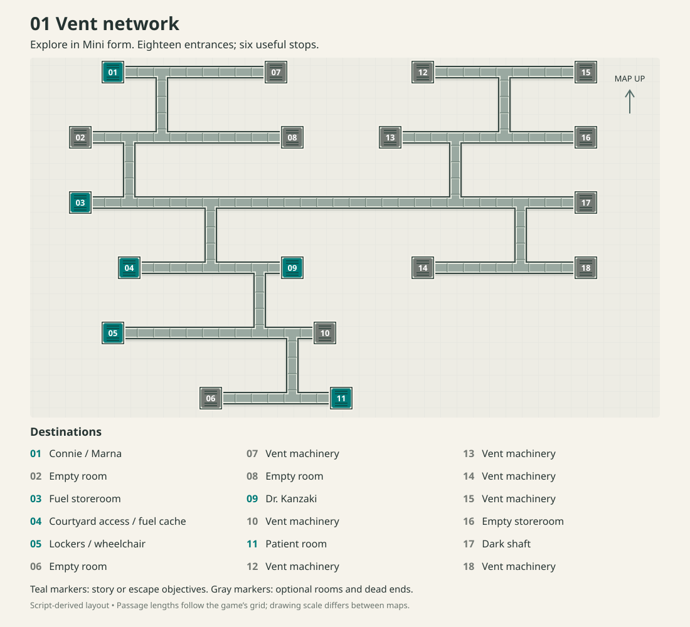
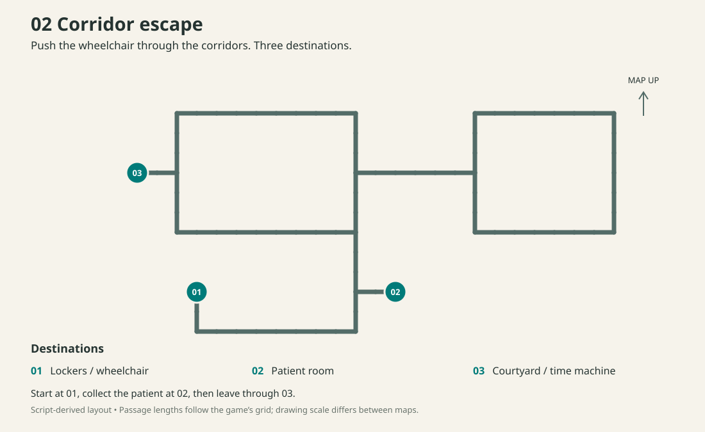

# Facility escape: vent and corridor maps

There are two mazes in the escape sequence: **the ventilation network**, explored
in Mini form, and **the corridors**, used later to push the wheelchair. The
second map is not another vent system.

**Spoilers for the facility section follow.** The maps reveal room locations
and the escape preparations, but do not explain the ending’s identity reveal.

- [Vent network](#1-vent-network)
- [What to do, and in what order](#getting-ready-to-escape)
- [Corridor escape](#2-corridor-escape)
- [Directions for common trips](#directions-for-common-trips)

## 1. Vent network



The six teal stops are the useful ones. The gray stops contain empty rooms or
ventilation machinery; you do not need to investigate every dead end.

| Stop | Place | Why go there? |
|---|---|---|
| **01** | Connie’s room / Marna | Your starting point. Return here for conversations, sleep, and the next stage of the plan. |
| **03** | Fuel storeroom | Find and collect the time machine’s fuel. |
| **04** | Corridor overlooking the courtyard | Inspect the time machine, then stash the fuel where you can retrieve it during the escape. |
| **05** | Locker room | Find the wheelchair and nurse’s uniform. Later, leave here on foot to enter map 2. |
| **09** | Dr. Kanzaki’s room | Check on the sleeping doctor during the later exploration. |
| **11** | Patient room | Locate Kanako, check her condition, and learn why you need a wheelchair. The displayed name follows the player’s chosen name. |

The right-hand half of the vent network is a large detour with no escape item.
The useful route descends through the left-hand connections. Stops 07, 10,
12–15, 17, and 18 lead toward ventilation machinery or dark shafts. Stops 02,
06, 08, and 16 are empty rooms or storage without a useful item.

### Getting ready to escape

Room descriptions change as the story advances. Reaching the right room is
only part of the puzzle: use **LOOK**, **THINK**, and the available conversations
until the scene moves on. A sealed vent or an empty room at one stage does not
mean you found the wrong entrance.

1. **Find Kanako at 11, then return to 01.** Continue the scene with Marna.
2. **Inspect the time machine through 04.** Connie discovers that it has no
   fuel. This gives her a reason to search the storeroom.
3. **Search 03, then return to 04 with the fuel.** Connie collects four tanks
   and ties them together so she can carry them in Mini form. Keep progressing
   the actions at 04 until she leaves the tanks by the corridor vent. Finding
   the tanks and hiding them are separate steps.
4. **Return to 01 and sleep.** Visit 11 again, then return to Marna when the
   patient is absent or the scene directs you back. Continue the next room
   scene before resuming exploration.
5. **Check 09 and 11.** The doctor and patient have different scenes now.
   Return to 01 for Marna’s conversation, then revisit 11 when Kanako is awake.
   Continue until Connie decides she needs a wheelchair.
6. **Search 05.** LOOK finds the folded wheelchair once that need has been
   established. THINK leads to the nurse’s disguise: the chair cannot travel
   through the ducts. Continue the locker-room and patient-room scenes, then
   return to 01 for the final conversation with Marna.
7. **Go back to 05 for the escape.** Connie puts on the uniform, unfolds the
   chair, and enters the corridors. Use map 2 from here.

If LOOK only reports lockers, the wheelchair-search stage has not been reached.
If the storeroom seems useless, inspect the machine at 04 first. Returning to
01 is part of advancing the story, not just backtracking.

This sequence is supported by the room scripts and agrees with the major
stops in the [Japanese walkthrough](https://w.atwiki.jp/retropcgame/pages/538.html).
Both reconstructed layouts also match its two map drawings. Its letter labels
differ from the numbered labels used here: A/B/C/D/E/F/G correspond to vent
stops 01/02/03/04/05/09/11; H and I are corridor stops 02 and 03.

## 2. Corridor escape



Numbers start over on this map:

| Stop | Place | What to do |
|---|---|---|
| **01** | Locker room | You enter the maze here with the wheelchair. This is vent-map stop 05. |
| **02** | Patient room | Collect Kanako and continue until Connie takes her into the corridor. This is vent-map stop 11. |
| **03** | Courtyard exit | Leave with the patient. Connie retrieves the cached fuel and heads for the time machine. |

The straightforward route is **01 → 02 → 03**. From 01, follow the bottom bend
to the junction outside 02. After collecting the patient, go up that passage,
then left through the middle connection to reach 03. The large loop on the
right is unnecessary.

The drawings use the game’s own map orientation, with up at the top. They are
separate navigation grids, not two floors that can be overlaid at the same
scale.

## Directions for common trips

These instructions begin **just after returning from the named room to the
maze**, in the position and facing direction the game sets. They are relative
to Connie’s view, not to the top of the drawing.

- `F` — take the forward arrow once.
- `L` / `R` — take the left / right passage arrow once. This turns **and moves**;
  it is not a turn in place.
- A number repeats an action: `F3` means forward three times.

One arrow action can cross more than one map square at a junction. Count
completed movements, not animation frames or the squares on the drawing.

### Vent trips

| From → to | Actions |
|---|---|
| 01 Connie → 11 patient | `F R F2 R L F2 L F3 R F2 L F R F2 L R F2 L F2` |
| 11 patient → 01 Connie | `F R F2 L R F2 L F R F2 L F3 R F2 R L F2 L F2` |
| 01 Connie → 04 courtyard access | `F R F2 R L F2 L F3 R F2 R F4` |
| 04 courtyard access → 03 fuel | `F3 L F2 L F6` |
| 03 fuel → 04 courtyard access | `F5 R F2 R F4` |
| 04 courtyard access → 01 Connie | `F3 L F2 L F3 R F2 R L F2 L F2` |
| 01 Connie → 09 doctor | `F R F2 R L F2 L F3 R F2 L F3` |
| 09 doctor → 11 patient | `L F2 L R F2 L F2` |
| 11 patient → 05 lockers | `F R F2 L F9` |
| 05 lockers → 01 Connie | `F7 L F2 L F R F2 L F3 R F2 R L F2 L F2` |
| 01 Connie → 05 lockers | `F R F2 R L F2 L F3 R F2 L F R F2 R F8` |

### Corridor trips

| From → to | Actions |
|---|---|
| 01 lockers → 02 patient | `L F6 L R F` |
| 02 patient → 03 courtyard | `R F L F7 R F L F` |

These action sequences were checked against a reconstruction of the original
movement rules. They have **not yet been replayed in the emulator**. If you
have moved since leaving a room, use the diagram to regain your bearings
instead of starting a sequence halfway through.

## How these maps were reconstructed

The layouts come from the original game, rather than a tracing of the old
walkthrough’s pictures. `SYSTEM.MLL` builds two navigation grids and defines
the movement rules. `F0034.MES` and `F0037.MES` connect their numbered entrances
to the room scenes. The Japanese text and translation catalog identify what
is at each stop.

The reconstruction follows all reachable positions and facings, including
junctions where forward skips a square and side arrows both turn and move.
All eighteen vent entrances and all three corridor entrances are reachable.
The geometry does not model story flags; the room scripts still determine
which conversations and actions are available.

<details>
<summary>Source references for checking or revising the maps</summary>

The original files are under `working/archives/`. Game data and extracted
artwork remain outside version control; these SVGs are newly drawn diagrams.
Coordinates below are zero-based positions in the navigation arrays.

| Source | Relevant content |
|---|---|
| `disk-a/SYSTEM.MLL` | Loaded-address range 38416–42116: tile definitions and both map layouts. File offsets are loaded addresses minus 31000. |
| `disk-a/SYSTEM.MLL` | Loaded addresses 35791–37655: view and permitted-arrow rules; 42117–44536: movement and entrance dispatch. |
| `disk-d/F0034.MES` | Eighteen entrance IDs, 0–17; return positions and facings; room 0 and room 10 have story-dependent script variants. |
| `disk-d/F0037.MES` | Three entrance IDs: 0 → locker room, 1 → patient room, 2 → courtyard exit. |
| `disk-d/F003402.MES` | Fuel search and collection; `0x0498` records the four tanks. |
| `disk-d/F003403.MES` | Machine inspection and fuel cache; `0x0cfd` starts setting down the fuel. |
| `disk-d/F003404.MES` | `0x05be`: wheelchair; `0x063f`: it will not fit in the vent; `0x093f`: nurse’s uniform; later transition to `F0037.MES`. |
| `disk-d/F003410.MES`, `F0034101.MES` | Patient-room stages; `F0034101:0x1be9` begins the wheelchair idea. |
| `disk-d/F003701.MES` | Courtyard and departure; `0x066d` retrieves the hidden fuel. |

The diagram numbers are entrance IDs plus one. Vent-map coordinates, in
number order:

```text
01 (4,0)    02 (2,4)    03 (2,8)    04 (5,12)   05 (4,16)   06 (10,20)
07 (14,0)   08 (15,4)   09 (15,12)  10 (17,16)  11 (18,20)  12 (23,0)
13 (21,4)   14 (23,12)  15 (33,0)   16 (33,4)   17 (33,8)   18 (33,12)
```

Corridor-map coordinates:

```text
01 (7,11)   02 (17,11)  03 (4,5)
```

The `DSMAP01.GP4` and `DSMAP02.GP4` images provide the in-game map backgrounds
and entrance markers. They do not contain the complete passage network;
that is why the reconstruction uses the navigation code.

</details>
